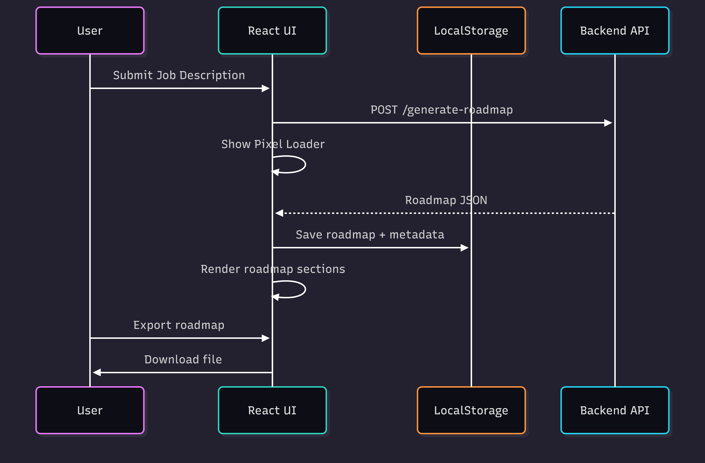

<div align="center">


# Crewmap 
## Agentic Job Roadmap Generator (Frontend)

**A React-based frontend that provides an interactive, AI-powered roadmap generation experience with modular components, local storage history, and export options.**

[Live Demo](https://your-demo-site-link.com)

</div>

---

## Overview

Crewmap Frontend allows users to generate **personalized, role-specific study roadmaps** using AI.  
The application is **modular, interactive, and responsive**, designed to work seamlessly with the backend AI engine.

Key features include:

- Section-wise roadmap rendering
- Collapsible roadmap blocks
- LocalStorage-based history
- Download as Markdown
- Interactive loader during AI processing
- Fully responsive sidebar and UI

---

## Tech Stack

### Core

- React 18+ with TypeScript
- Tailwind CSS for styling
- React hooks for state management

### Utilities

- LocalStorage API for persistence
- Markdown parsing and rendering
- Modular React components for layout, loader, roadmap, and history

---

## User Interaction Flow

1. User inputs job description or company info
2. Loader pixel game is displayed while AI generates roadmap
3. Roadmap is rendered in collapsible sections
4. Users can interact with sections, collapse/expand, or scroll
5. Generated roadmap is saved to LocalStorage automatically
6. Users can revisit previous roadmaps via sidebar
7. Roadmaps can be exported as Markdown or PDF



---

## Running Locally

```bash
npm install
npm run dev
````

* Open [http://localhost:5173](http://localhost:5173) to see the app
* Sidebar displays history and allows clearing entries
* Pixel loader engages users during AI processing

---

## Design Philosophy

* **Modular Components:** Isolated, reusable UI pieces for roadmap, loader, and history
* **Interactivity:** Loader game, collapsible sections, and clickable history entries
* **Responsiveness:** Sidebar toggle, full-width roadmap display, mobile-friendly
* **User Engagement:** Pixel game keeps users busy during AI latency

---

## Future Improvements

* User authentication and cloud-synced history
* Real-time roadmap progress tracking
* Additional mini-games for loaders
* More export formats (Excel, Google Docs)
* Customizable roadmap templates
