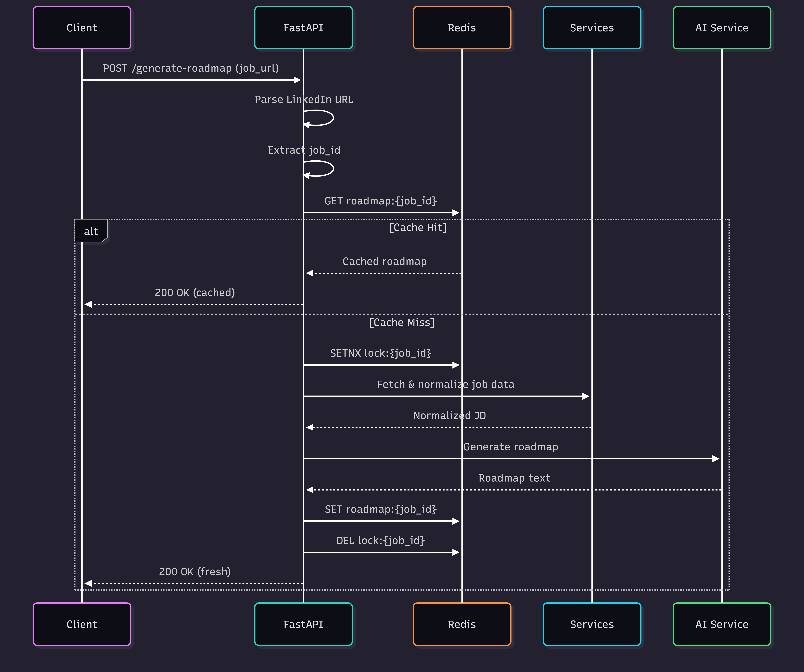
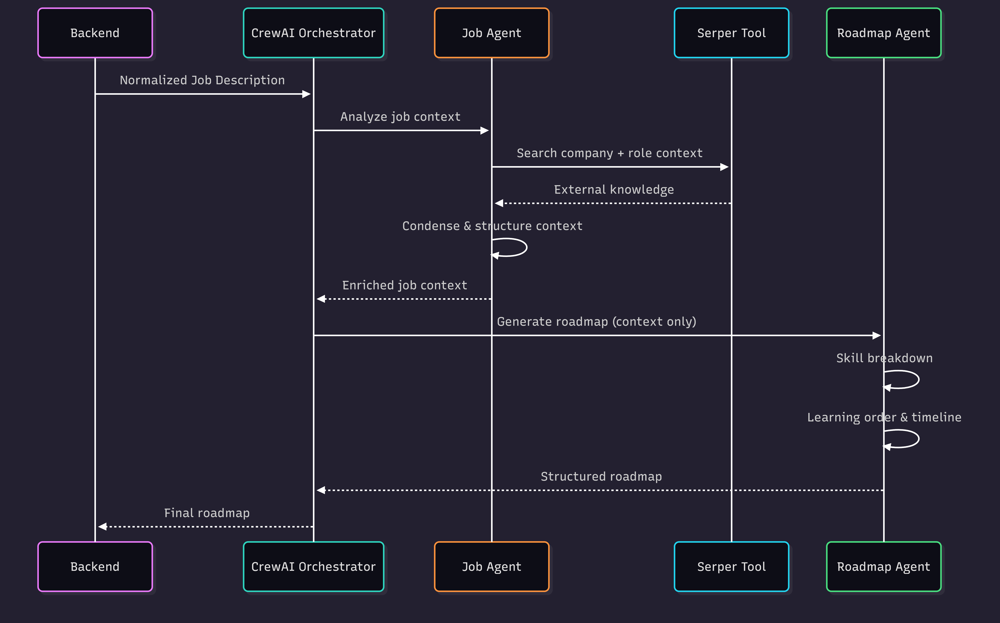

<div align="center">


# Crewmap 
## Agentic Job Roadmap Generator (Backend)

**A production-grade backend that converts LinkedIn job listings into structured learning roadmaps using a multi-agent AI system.**

[Live Demo](https://crewmap-ecru.vercel.app/)

</div>

---

## Overview

This service takes a **LinkedIn job URL** and returns a **clear, role-specific study roadmap**.  
It is built as a backend-first system with a strong focus on correctness, concurrency safety, caching, and real-world multi-user behavior.

The roadmap itself is generated using a **multi-agent CrewAI system**, where each agent analyzes a different part of the job context before producing a consolidated learning plan.

---

## What This Backend Does

- Extracts job IDs from LinkedIn job URLs
- Fetches and normalizes job descriptions
- Runs a multi-agent AI workflow to:
  - analyze company context
  - analyze job requirements
  - synthesize a structured study roadmap
- Caches generated roadmaps in Redis
- Uses Redis-based locking to prevent duplicate generation during concurrent requests

---

## Tech Stack

### Core
- Python 3.11+
- FastAPI
- Pydantic

### AI
- CrewAI (agent orchestration)
- Gemini (LLM provider)

### Infrastructure
- Redis (Redis Cloud)

---

## High-Level Request Flow



1. Client sends a LinkedIn job URL
2. Job ID is extracted from the URL
3. Redis is checked for an existing roadmap
4. If cached → return immediately
5. If not cached:
   - Acquire a Redis lock for the job ID
   - Fetch job details
   - Execute the CrewAI workflow
   - Store the roadmap in Redis
   - Release the lock
6. Return the roadmap to the client

This ensures idempotency, safe parallel usage, and minimal LLM cost.

## Agentic AI system flow



---

## API

### `POST /generate-roadmap`

Generates or retrieves a cached roadmap for a LinkedIn job.

#### Request
```json
{
  "job_url": "https://www.linkedin.com/jobs/view/software-engineer-123456789/"
}
````

#### Response

```json
{
  "roadmap": "Week 1: Backend fundamentals...\nWeek 2: System design..."
}
```

---

## Environment Variables

Create a `.env` file in the project root and follow .env.example

---

## Running Locally

```bash
python -m venv .venv
source .venv/bin/activate  # Windows: .venv\Scripts\activate

uvicorn roadmap.api:app --reload
```

* API: [http://localhost:8000](http://localhost:8000)
* Swagger UI: [http://localhost:8000/docs](http://localhost:8000/docs)

---

## Project Structure

```
roadmap/
│
├── api.py                  # FastAPI application
├── crew.py                 # CrewAI agents and tasks
│
├── cache/
│   ├── redis_client.py     # Redis connection
│   └── roadmap_cache.py   # Cache and lock helpers
│
├── services/
│   └── job_fetcher.py      # Job data extraction
│
├── utils/
│   └── linkedin.py         # LinkedIn URL parsing
│
└── .env
```

---

## Design Notes

* Redis is used instead of in-memory caching to support multiple users and instances
* Redis locks prevent duplicate roadmap generation under concurrent access
* Blocking AI operations are safely offloaded using thread pools
* The backend is stateless aside from Redis, making it horizontally scalable
